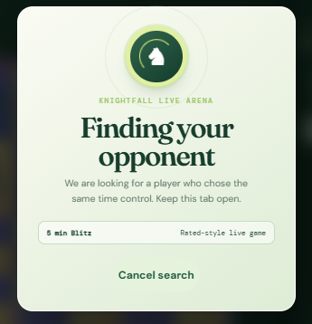
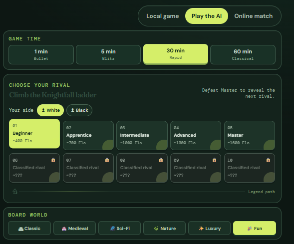
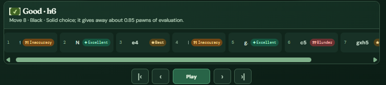
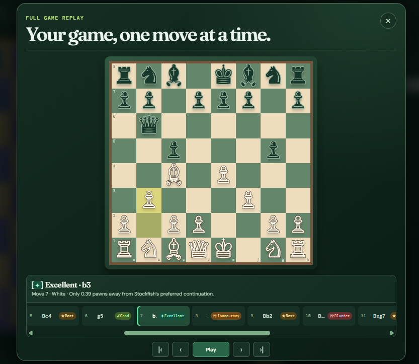
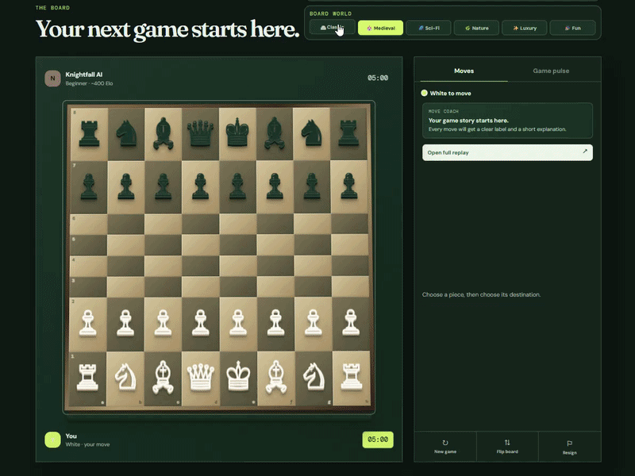

# ♞ Knightfall Chess

<p align="center">

# Play the move. Know the story.

A modern browser-based chess platform that combines beautiful design, competitive gameplay, and powerful post-game analysis. Challenge AI opponents, play online with friends, customize your board, and review every move with Stockfish-powered engine analysis.

🌐 **Live Demo:** https://knightfall-chess.onrender.com

💻 **GitHub Repository:** https://github.com/Loledproski/knightfall-chess

</p>

---

# About

Knightfall Chess is a modern multiplayer chess platform designed to make every game both competitive and educational. Inspired by professional online chess platforms while maintaining its own unique identity, Knightfall combines real-time gameplay with powerful post-game analysis in a clean and responsive interface.

Players can enjoy local games, challenge progressively stronger AI opponents through a ten-level difficulty ladder, or compete against other players using real-time WebSocket matchmaking. Every completed game can be analyzed using Stockfish 18, providing detailed engine evaluations, color-coded move classifications, interactive replay controls, and clear explanations that help players understand both their mistakes and their best moves.

Built using HTML, CSS, Vanilla JavaScript, Node.js, WebSockets, and WebAssembly, Knightfall focuses on delivering a lightweight yet feature-rich chess experience that runs entirely in the browser without sacrificing performance or visual quality.

---

# ✨ Features

## ♟ Gameplay

- Local Pass-and-Play Chess
- Real-Time Online Multiplayer
- Multiple Time Controls (1, 5, 30 & 60 Minutes)
- Complete Chess Rules
- Castling
- En Passant
- Pawn Promotion
- Checkmate, Draw & Stalemate Detection
- Live Chess Clocks

---

## 🤖 AI Challenge

- 10 Progressive AI Difficulty Levels
- Beginner to Master Difficulty Ladder
- Five Unlockable Legendary Opponents
- Increasing Elo-Based Difficulty Progression

---

## 🌍 Online Multiplayer

Knightfall includes a WebSocket-powered online matchmaking system that allows players to compete in real time. Players selecting the same time control are automatically matched into a live game where every move is synchronized instantly between both browsers, creating a smooth multiplayer experience with minimal latency.

Features include:

- Live Matchmaking Queue
- Real-Time Move Synchronization
- Automatic Opponent Pairing
- Multiple Time Controls
- Shared Game State
- Low-Latency Gameplay

---

## 📊 Stockfish Game Analysis

Every completed game can be reviewed using the integrated Stockfish 18 WebAssembly engine. Instead of simply displaying moves, Knightfall explains the quality of every decision using engine evaluations and intuitive visual feedback.

The analysis system includes:

- Stockfish 18 Engine Analysis
- Position Evaluation
- Best Move Detection
- Color-Coded Move Quality
- Interactive Move Replay
- Dark-Themed Review Interface
- Engine Explanations
- Smooth Replay Controls

Move classifications include:

- Brilliant
- Great
- Best
- Excellent
- Good
- Book
- Inaccuracy
- Mistake
- Blunder
- Miss

---

## 🎨 Customization

Knightfall offers multiple handcrafted chess board themes, allowing every player to personalize the game experience.

Available themes include:

- Classic
- Medieval
- Sci-Fi
- Nature
- Luxury
- Fun

Additional customization includes:

- Light & Dark Mode
- Responsive Layout
- Modern UI Animations
- Beautiful Piece Effects

---

# 📸 Screenshots

## 🏠 Landing Page

A modern homepage introducing Knightfall with a clean interface focused on competitive chess and game analysis.


---

## 🌍 Online Matchmaking

Search for live opponents using WebSocket-powered matchmaking. Players selecting the same time control are automatically paired into an online game.



---

## ⏱ AI Match Setup

Configure your preferred game time, choose your side, select an AI difficulty, and customize the chess board before every match.



---

## ♟ Gameplay

Play against Knightfall AI or another online player with live timers, move coaching, responsive controls, and real-time move synchronization.


---

## 📊 Stockfish Analysis

Review every move with Stockfish-powered engine evaluations, detailed explanations, and color-coded move classifications that make learning easier.



---

## 🎬 Interactive Replay

Replay every move using an interactive timeline featuring dark mode, smooth navigation controls, and highlighted move quality for every position.



---

## 🎨 Board Themes

Instantly switch between six handcrafted board themes during gameplay to personalize your chess experience.



---

# 🛠 Technology Stack

### Frontend

- HTML5
- CSS3
- Vanilla JavaScript

### Backend

- Node.js
- Native HTTP Server
- WebSockets

### Chess Engine

- Stockfish 18 Lite (WebAssembly)

### Deployment

- GitHub
- Render

---

# 📂 Project Structure

```
Knightfall Chess
│
├── engine/
│   └── Stockfish 18
│
├── screenshots/
│
├── index.html
├── styles.css
├── app.js
├── server.js
├── package.json
├── Dockerfile
├── LICENSE
└── README.md
```

---

# 🚀 Run Locally

1. Install the latest Node.js LTS version.

2. Clone the repository.

```bash
git clone https://github.com/Loledproski/knightfall-chess.git
```

3. Install dependencies.

```bash
npm install
```

4. Start the server.

```bash
npm start
```

5. Open your browser and visit:

```
http://localhost:3000
```

---

# 🚀 Future Roadmap

Knightfall is actively evolving, with several exciting features planned for future releases.

### Competitive

- Elo Rating System
- Ranked Matchmaking
- Global Leaderboards
- Tournament Mode

### Social

- User Authentication
- Friends System
- Private Rooms
- Spectator Mode

### Analysis

- Opening Explorer
- Endgame Trainer
- Puzzle Mode
- Match History

### Platform

- Cloud Save
- Mobile Optimization
- Progressive Web App (PWA)
- Custom Piece Sets

---

# 📜 License

This project is licensed under the MIT License.

---

# ❤️ Acknowledgements

- Stockfish Chess Engine
- Node.js
- Render
- GitHub

---

<p align="center">

Made with ❤️ by **Harsh Mishra**

If you enjoyed this project, consider giving it a ⭐ on GitHub!

</p>
