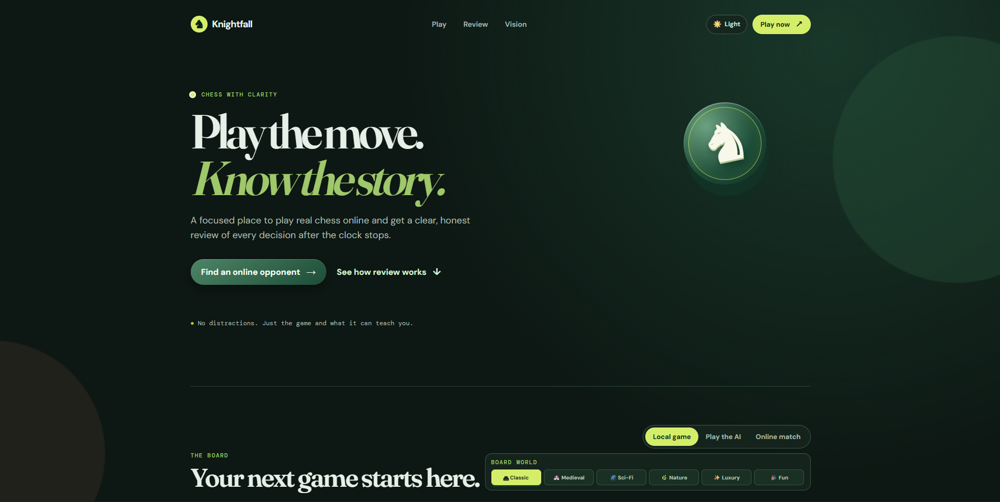
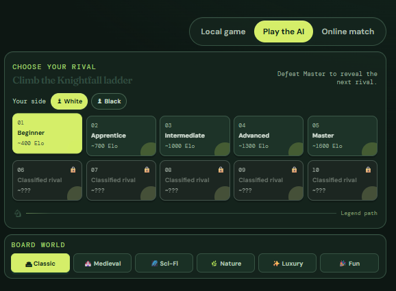
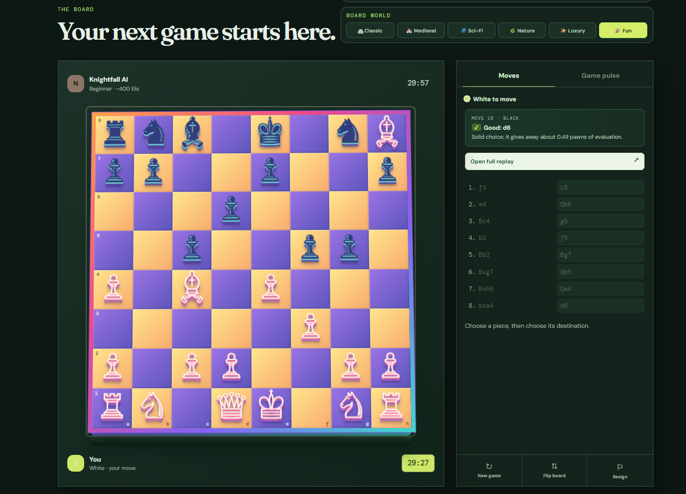
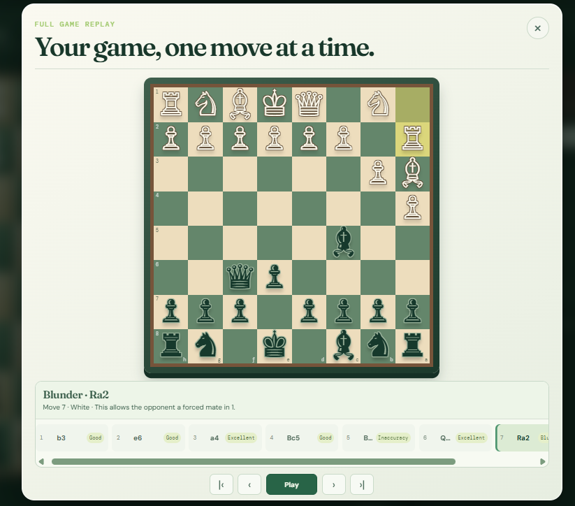

# Knightfall Chess
A modern multiplayer chess platform featuring local play, AI opponents, online matchmaking, and Stockfish-powered game review.

## 🌐 Live Demo

**🎮 Play Knightfall:** https://knightfall-chess.onrender.com

**💻 GitHub Repository:** https://github.com/Loledproski/knightfall-chess

> ⚠️ **Project Status:** Online matchmaking is currently under active development. Local Play, AI Ladder, and Stockfish Review are fully functional.

---

## ✨ Features

- ♟️ Local Pass-and-Play Chess
- 🤖 10-Level AI Difficulty Ladder
- 👑 Legendary Opponents Unlock System
- 🌍 Online Multiplayer (Work in Progress)
- 🧠 Stockfish-Powered Move Review
- 📈 Interactive Game Replay
- 🎨 Multiple Board Themes
- 🌗 Light & Dark Mode
- ⚡ Responsive Modern UI
- 🚀 Hosted on Render

---

## 📸 Screenshots

### 🏠 Landing Page

---

### 🤖 AI Difficulty Ladder

---

### ♟️ Gameplay

---

### 📊 Move Review & Replay

---

## Run it locally

1. Install the current **Node.js LTS** version from [nodejs.org](https://nodejs.org/).
2. Double-click `START-KNIGHTFALL.bat` in this folder.
3. Keep the small server window open while you play. The website opens itself.

If you later feel comfortable using a terminal, the equivalent command is `npm start`.

Open the site in two browser windows and press **Find an online opponent** in both to test matchmaking.

## What is already included

- Responsive chess board and local pass-and-play mode.
- Play Knightfall AI locally across a ten-rival ladder, from Beginner (~400) through Master (~1600) and five legendary locked challenges. Defeat Master once to unlock the legends on that browser.
- Legal move filtering, including check, castling, en passant, and automatic queen promotion.
- WebSocket queue matchmaking and move relay for two online players.
- A transparent move-review foundation that labels moves with provisional heuristic categories.
- A 3D board presentation, important-piece capture effects, user-selected pawn promotion, light/dark themes, and a win/loss/draw screen with a direct link to the game review.

## Before making it public

The included server is deliberately small, so the next production steps are important:

1. Run a trusted chess rules engine on the server; never trust moves sent by a browser.
2. Add accounts, rating, persistent games, clocks, reconnects, and rate limits.
3. For production-scale analysis, add server-side Stockfish workers or a cloud analysis service alongside the included browser engine.
4. Train/calibrate your label thresholds using a large set of engine-analysed human games. This is how labels such as `Best`, `Excellent`, `Good`, `Inaccuracy`, `Mistake`, and `Blunder` become consistently useful.

The built-in AI ladder is a browser-friendly challenge system. The included Stockfish engine powers reviews; using it for the top playing levels is the next AI upgrade.

## Stockfish review engine

The site now includes the Stockfish 18 lite single-threaded WebAssembly build for local browser analysis. New moves are first marked `Analyzing`, then upgraded to engine-backed labels based on the evaluation before and after the move. This detects missed forced mates and moves that allow mate.

The first analysis download is about 7 MB and runs locally in the player's browser. See [engine/NOTICE.md](engine/NOTICE.md) for the Stockfish.js attribution and license notice.

The review UI in this starter is intentionally separated from the game board, so an engine-backed analyser can replace the simple scorer without changing the design.

## Share it with friends anywhere

This local version only works on your computer. The project is now ready for a Node.js host that supports WebSockets:

1. Create a GitHub account and upload this whole folder as a new repository.
2. Create a **Web Service** at a host such as Render and connect that repository.
3. Use `npm start` as the start command. The app reads the host's `PORT` setting automatically.
4. The host gives you a public URL. Send that URL to friends — they can then join the same online queue.
5. For a memorable name, connect a custom domain after the first deployment.

To appear in Google Search, the public site must be live first. Verify the domain in Google Search Console and request indexing; search visibility takes time and is never instant.
